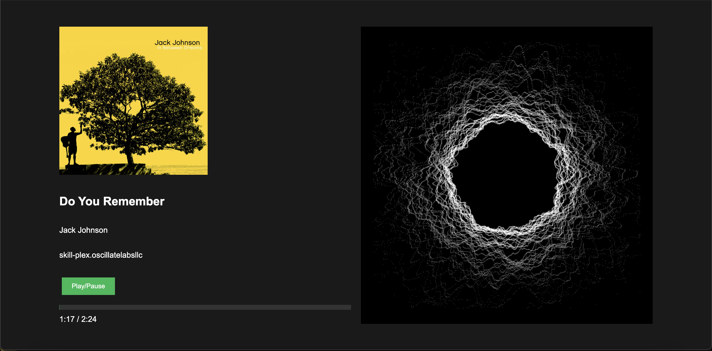

# OVOS Music Visualizer

[](https://github.com/OscillateLabsLLC/.github/blob/main/SUPPORT_STATUS.md)

This project is a web-based music visualizer for OpenVoiceOS (OVOS), specifically [ovos-mac](https://github.com/OscillateLabsLLC/ovos-mac). It displays the currently playing track information, album art, and a simple visualization, along with playback controls.



## Features

- Displays current track information (title, artist, album)
- Shows album art
- Provides play, pause, stop, previous, and next controls
- Displays a progress bar and current/total time
- Includes a simple audio visualization

## Prerequisites

Before you begin, ensure you have met the following requirements:

- You have a running instance of OpenVoiceOS
- Python 3.10 or newer, and [uv](https://docs.astral.sh/uv/)
- You have basic knowledge of terminal/command line operations

## Setting up OVOS Music Visualizer

To set up OVOS Music Visualizer, follow these steps:

1. Clone the repository:

   ```sh
   git clone https://github.com/OscillateLabsLLC/ocp-mac-visualizer.git
   cd ocp-mac-visualizer
   ```

2. Install the dependencies:

   ```sh
   uv sync
   ```

3. Configure the server (optional):

- The bridge reads `OVOS_BUS_URL`, `HOST`, and `PORT` from the environment. The defaults are OVOS' own defaults plus `127.0.0.1:3000`:

  ```bash
  OVOS_BUS_URL="ws://127.0.0.1:8181/core" HOST=127.0.0.1 PORT=3000 uv run python server.py
  ```

- Use `wss://` if your OVOS instance is behind TLS.

- If your OVOS instance is running on a different IP or port, update this URL accordingly.

4. Start the server:

   ```sh
   uv run python server.py
   ```

5. Open a web browser and navigate to `http://localhost:3000` (or the appropriate address if you've configured a different port).

## Usage

Once the visualizer is running:

1. Start playing music on your OVOS device.
2. The visualizer should automatically update with the current track information.
3. Use the play/pause button to control playback.
4. The progress bar and time display will update as the track plays.

## Troubleshooting

If you encounter issues:

- Ensure your OVOS instance is running and accessible.
- Check that `OVOS_BUS_URL` points at your OVOS instance.
- Look at the server console and browser console for any error messages.

## Contributing

Contributions to the OVOS Music Visualizer are welcome. Please feel free to submit a Pull Request.

## License

This project is licensed under the [Apache 2.0 license](LICENSE).

## Acknowledgements

- OpenVoiceOS team for the amazing open-source voice assistant platform.
- All contributors and users of this project.
- Claude.AI for doing almost all the work on this project. I'm not much of a frontend developer, so I appreciate the help!
